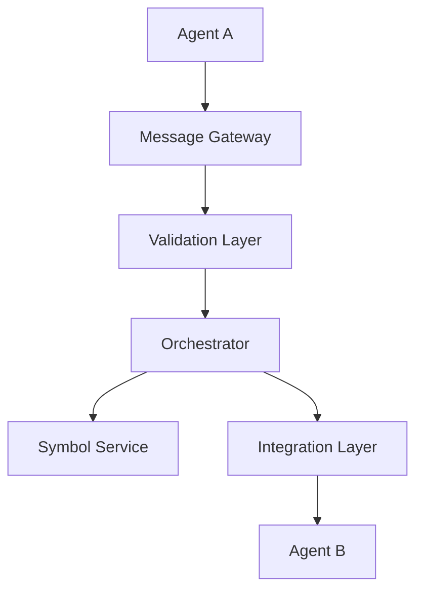

# AIFL Architecture Overview

## System Architecture

The AIFL architecture is designed to provide a scalable, extensible, and modular foundation for AI agent communication and collaboration. This section provides a comprehensive overview of the main components and their interactions within the AIFL ecosystem.

### Core Components

#### 1. Message Gateway
- Entry point for all agent communications
- Initial message validation and authentication
- Protocol version negotiation
- Load balancing and traffic management

#### 2. Orchestrator
The central coordination component responsible for:
- Message routing and delivery
- Conversation state management
- Agent registration and discovery
- Task coordination and delegation
- Error handling and recovery

#### 3. Symbol Service
Manages the AIFL language components:
- Symbol registration and validation
- Grammar rule enforcement
- Version management
- Domain-specific extensions

#### 4. Integration Layer
Enables communication with various AI platforms through:
- Platform-specific adapters
- Protocol translation
- Rate limiting and quota management
- Error mapping and recovery

### Communication Flow

### Key Design Principles

1. **Modularity**
   - Independent, loosely coupled components
   - Clear interface boundaries
   - Pluggable architecture
   - Extensible design

2. **Scalability**
   - Horizontal scaling capabilities
   - Distributed processing
   - Load balancing
   - Resource optimization

3. **Reliability**
   - Error detection and recovery
   - Message delivery guarantees
   - State persistence
   - Failover mechanisms

4. **Security**
   - Authentication and authorization
   - Message encryption
   - Access control
   - Audit logging

## Component Interactions

### Message Processing Pipeline

1. **Message Reception**
   - Protocol validation
   - Authentication check
   - Rate limit verification
   - Initial parsing

2. **Message Routing**
   - Destination resolution
   - Path optimization
   - Priority handling
   - Load distribution

3. **Message Execution**
   - Symbol validation
   - Grammar checking
   - State management
   - Response generation

4. **Result Handling**
   - Response validation
   - State updates
   - Error processing
   - Delivery confirmation

## Deployment Architecture

### Local Development
- Standalone mode
- Development tools
- Testing utilities
- Debug capabilities

### Production Deployment
- Container orchestration
- Service mesh integration
- Monitoring and logging
- Performance optimization

### Cloud Integration
- Multi-cloud support
- Service scaling
- Resource management
- Geographic distribution

## System Requirements

### Minimum Requirements
- Python 3.8+
- Database support
- Message broker
- Cache service

### Recommended Configuration
- Load balancer
- Monitoring system
- Logging infrastructure
- Backup services

## Next Steps

- Explore [Key Components](key-components.md) for detailed component information
- Review the [Symbol Dictionary](symbol-dictionary.md) for language specifications
- Check [Integration Guides](../Integration_Guides/Swarm_API_Integration.md) for platform integration
- Follow [Installation Guide](../Developer_Guide/getting_started.md) for setup instructions