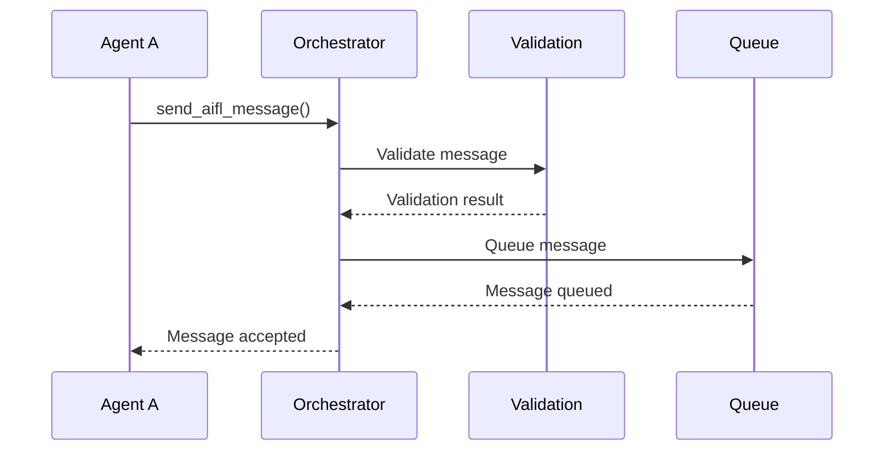
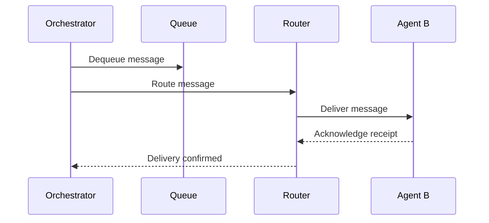
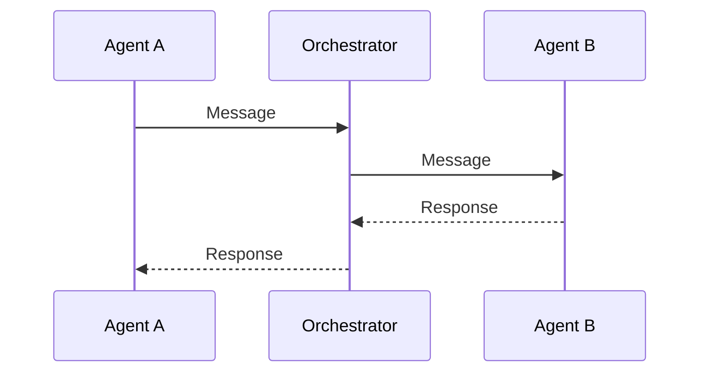
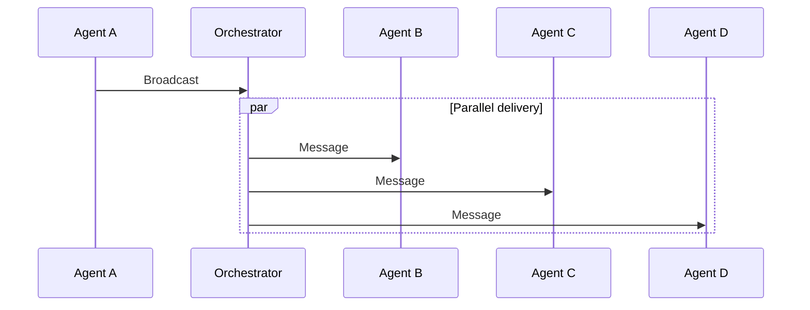
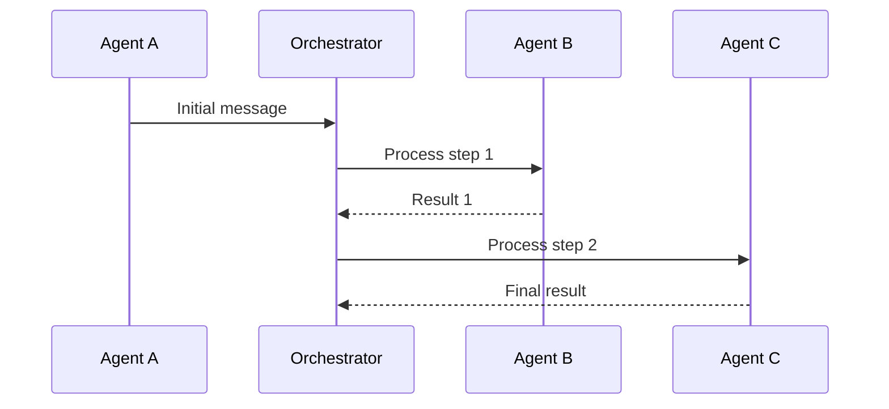

# AIFL Message Flow

## Message Lifecycle

### 1. Message Creation


### 2. Message Processing


## Message States

1. **Submitted**
   - Message received by orchestrator
   - Initial validation performed
   - Assigned message ID

2. **Processing**
   - Message in routing phase
   - Target agents identified
   - Delivery attempted

3. **Delivered**
   - Message received by target
   - Confirmation received
   - History updated

4. **Failed**
   - Delivery unsuccessful
   - Retry if applicable
   - Error reported

## Integration Example

```python
# Sending agent
await orchestrator.send_aifl_message(
    conversation_id="conv_123",
    from_agent="agent_a",
    message="ΜΑΝ1(Topic: 'Example')"
)

# Receiving agent
class MyIntegration(BaseAIIntegration):
    async def send_message(self, aifl_message: str, 
                         conversation_id: str, 
                         context: Dict) -> str:
        response = await self.process_message(aifl_message)
        return response
```

## Error Handling

### Error Types
1. **Validation Errors**: Invalid AIFL syntax
2. **Routing Errors**: Agent not found/available
3. **Delivery Errors**: Communication failures
4. **Protocol Errors**: Invalid message sequence

### Error Response Format
```python
# AIFL error message format
"ΕΧΛ1(ErrorCode: 'CODE', Description: 'details')"
```

## Message Patterns

### 1. Direct Communication


### 2. Broadcast


### 3. Sequential Processing


## Best Practices

1. **Message Design**
   - Use appropriate AIFL symbols
   - Include necessary context
   - Follow protocol specifications

2. **Error Handling**
   - Implement timeout handling
   - Process error responses
   - Follow retry guidelines

3. **Performance**
   - Monitor message sizes
   - Handle responses asynchronously
   - Implement proper cleanup
