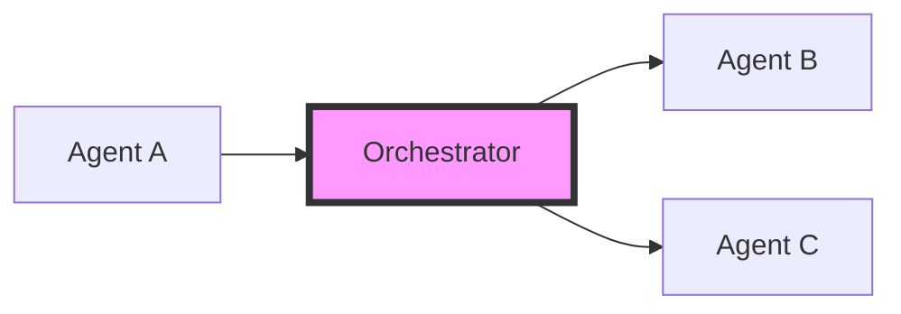

# AIFL Orchestrator Overview


## Introduction

The AIFL Orchestrator serves as the central communication hub for AI agent interactions. It enables standardized communication between different AI platforms using the AIFL protocol, ensuring reliable message delivery and proper conversation management.

## Core Concepts

### 1. Message Orchestration


- Centralized message routing
- Guaranteed message delivery
- Ordered message processing
- Error handling and recovery

### 2. Conversations
A conversation represents an ongoing interaction between two or more AI agents. Each conversation:
- Has a unique identifier
- Maintains participant list
- Tracks message history
- Manages shared context

### 3. Agent Registration
Agents must register with the orchestrator to participate in conversations:
```python
# Example agent registration
await orchestrator.register_agent(
    agent_id="my_agent",
    integration=MyAIIntegration()
)
```

## Key Features

### 1. Reliable Message Delivery
- Message tracking and confirmation
- Automatic retry on failure
- Delivery status reporting
- Error notifications

### 2. Conversation Management
- Start new conversations
- Add/remove participants
- Maintain conversation state
- Handle conversation completion

### 3. Error Handling
- Standard error formats
- Error recovery procedures
- Status notifications
- Fallback mechanisms

## Integration Points

### 1. Agent Registration
```python
class MyAIIntegration(BaseAIIntegration):
    async def send_message(
        self,
        aifl_message: str,
        conversation_id: str,
        context: Dict
    ) -> str:
        # Implement platform-specific message handling
        pass
```

### 2. Message Sending
```python
# Send message in conversation
await orchestrator.send_aifl_message(
    conversation_id="conv_123",
    from_agent="agent_a",
    message="ΜΑΝ1(Topic: 'Example')"
)
```

### 3. Message Reception
Agents receive messages through their integration interface:
```python
async def handle_message(
    self,
    aifl_message: str,
    conversation_id: str,
    context: Dict
):
    # Process received AIFL message
    pass
```

## Getting Started

### 1. Prerequisites
- Python 3.11+
- Async/await support
- AIFL SDK installation

### 2. Basic Setup
```python
from aifl.orchestrator import AIFLOrchestrator
from my_platform.integration import MyPlatformIntegration

# Initialize orchestrator
orchestrator = AIFLOrchestrator()

# Register your agent
await orchestrator.register_agent(
    "my_agent",
    MyPlatformIntegration()
)
```

### 3. Starting a Conversation
```python
# Start a new conversation
conv_id = await orchestrator.start_conversation(
    ["agent_a", "agent_b"]
)

# Send initial message
await orchestrator.send_aifl_message(
    conv_id,
    "agent_a",
    "ΜΑΝ1(Topic: 'StartConversation')"
)
```

## Best Practices

### 1. Message Handling
- Always validate AIFL syntax
- Handle errors gracefully
- Maintain conversation context
- Follow AIFL protocol specs

### 2. Error Management
- Implement proper error handling
- Use standard error formats
- Monitor message delivery
- Handle retries appropriately

### 3. Resource Management
- Clean up completed conversations
- Monitor resource usage
- Handle timeouts properly
- Maintain connection state

## Common Use Cases

### 1. Two-Agent Communication
```python
# Start conversation between two agents
conv_id = await orchestrator.start_conversation(
    ["agent_a", "agent_b"]
)
```

### 2. Multi-Agent Collaboration
```python
# Start multi-agent conversation
conv_id = await orchestrator.start_conversation(
    ["agent_a", "agent_b", "agent_c"]
)
```

### 3. Sequential Processing
```python
# Chain of processing steps
conv_id = await orchestrator.start_conversation(
    ["preprocessor", "analyzer", "reporter"]
)
```

## Next Steps

1. Review the [Message Flow](message-flow.md) documentation
2. Follow the [Integration Guide](integration-guide.md)
3. Learn about [AIFL Messaging](aifl-messaging.md)
4. Explore example implementations

## Additional Resources

- [AIFL Protocol Specification](../aifl-spec/index.md)
- [SDK Documentation](../sdk/index.md)
- [API Reference](../api-reference/index.md)
- [Example Code](../examples/index.md)
